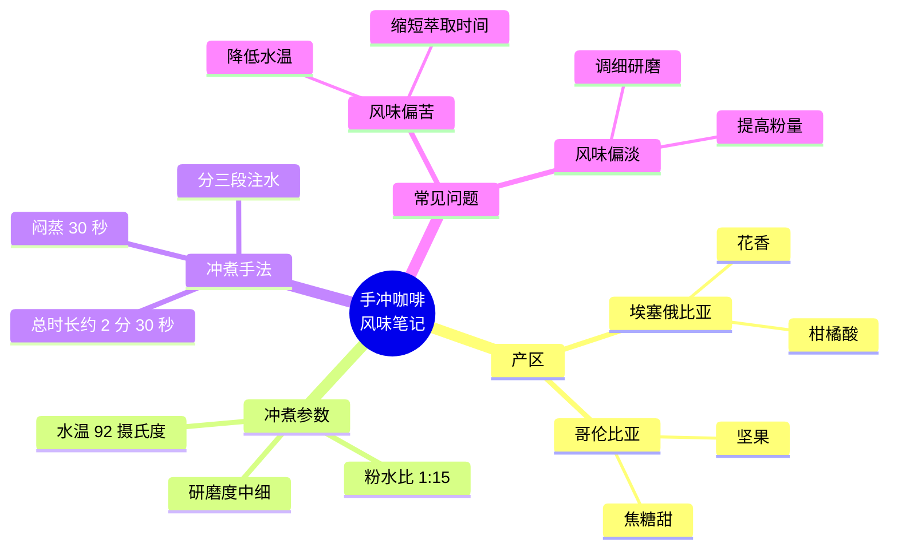

# 手冲咖啡风味笔记

```mermaid
mindmap
  root((手冲咖啡<br/>风味笔记))
    产区
      埃塞俄比亚
        花香
        柑橘酸
      哥伦比亚
        坚果
        焦糖甜
    冲煮参数
      水温 92 摄氏度
      粉水比 1:15
      研磨度中细
    冲煮手法
      闷蒸 30 秒
      分三段注水
      总时长约 2 分 30 秒
    常见问题
      风味偏苦
        降低水温
        缩短萃取时间
      风味偏淡
        调细研磨
        提高粉量
```
